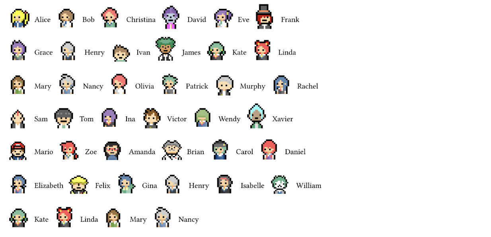

# Pixel People for Typst

Pixel people with names.

> **Disclaimer**
> These characters are created by Brave Workz, available on the Line Store:
> https://store.line.me/emojishop/product/61075ddc3cc24041bb144d70/en
> https://store.line.me/emojishop/product/5f5722aaf5a60e01d42e398a/en
> 
> We really love these characters and only use the images for non-commercial purposes. If the author wants to remove these images, please file an issue.

## Usage
To start using `pixel-people`, just use the following code:

```typ
#include "lib.typ"

#alice() Alice
#bob() Bob
#christina() Christina
#david() David
#eve() Eve
#frank() Frank
#grace() Grace
#henry() Henry
#ivan() Ivan
#james() James
#kate() Kate
#linda() Linda
#mary() Mary
#nancy() Nancy
#olivia() Olivia
#patrick() Patrick
#murphy() Murphy
#rachel() Rachel
#sam() Sam
#tom() Tom
#ina() Ina
#victor() Victor
#wendy() Wendy
#xavier() Xavier
#mario() Mario
#zoe() Zoe
#amanda() Amanda
#brian() Brian
#carol() Carol
#daniel() Daniel
#elizabeth() Elizabeth
#felix() Felix
#gina() Gina
#henry() Henry
#isabelle() Isabelle
#william() William
#kate() Kate
#linda() Linda
#mary() Mary
#nancy() Nancy
```

The output will be:
